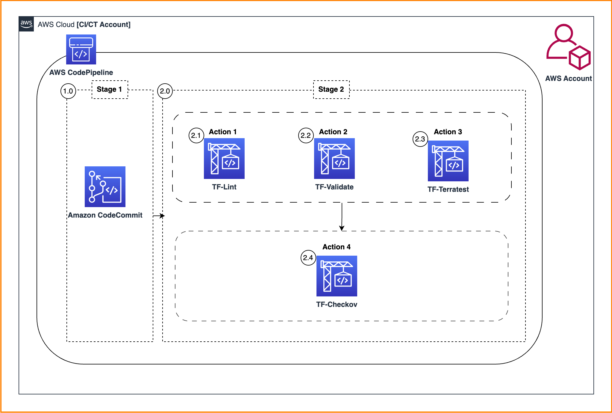
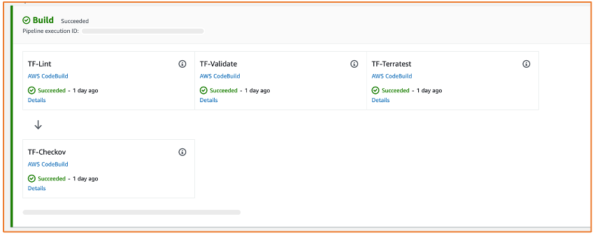
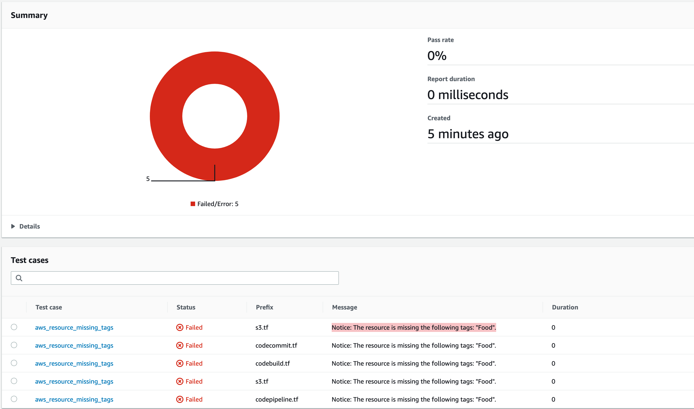
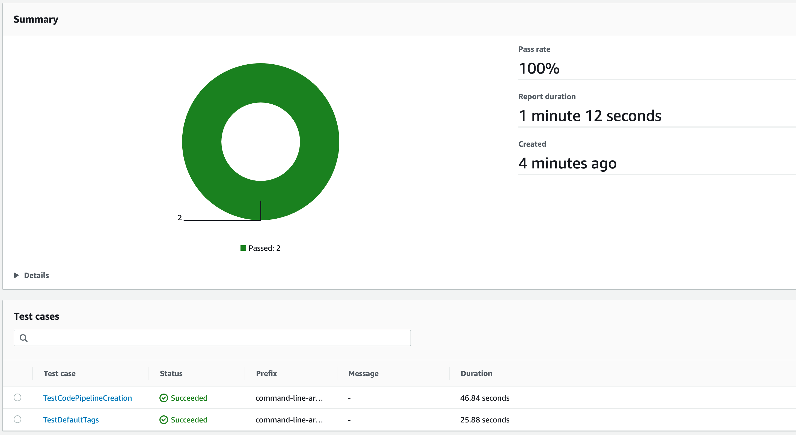
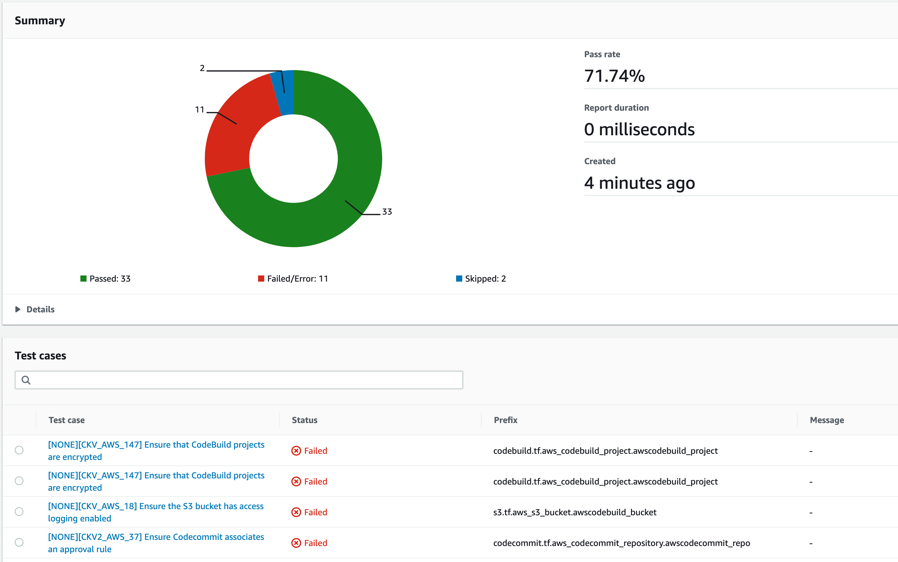

# Continuously test Terraform Infrastructure code on AWS with TFlint, Terratest, and Checkov

## Table of Contents
- [Introduction](#introduction)
  - [Why Infrastructure Testing Matters](#why-infrastructure-testing-matters)
  - [Target Audience](#target-audience)
  - [UseCase](#usecase)
  - [Key Components of the Guide](#key-components-of-the-guide)
    - [Utilizing AWS Developer Tools](#1-utilizing-aws-developer-tools)
    - [Open-Source Tool Integration](#2-open-source-tool-integration)
    - [Building CI/CT Pipelines](#3-building-cict-pipelines)
    - [Identify Anomalies and Generate Reports](#4-identify-anomalies-and-generate-reports)
  - [Getting Started](#getting-started)
    - [Solution Architecture](#solution-architecture)
    - [Repository structure](#repository-structure)
    - [/terraform]()
        - [/terraform/examples]()
        - [/terraform/modules]()
  - [CodeBuild Workflow](#codebuild-workflow)
    - [Walkthrough](#walkthrough)
        - [Prerequisites](#pre-requisites)
        - [1. Deploy CI/CT  pipeline](#1-deploy-cict-pipeline)
        - [2. Review the test code and tune it according to your own preferences](#2-review-the-test-code-and-tune-it-according-to-your-own-preferences)
            - [TF-Lint](#action-1--tf-lint)
            - [TF-Validate](#action-2--tf-validate)
            - [TF-Terratest](#action-3--tf-terratest)
            - [TF-Checkov](#action-4--tf-checkov)
        - [3. Push the code into the CodeCommit repository](#3-push-the-code-into-the-codecommit-repository)
        - [4. Reports](#4-reports)
  - [Clean Up](#clean-up)
   - [Troubleshooting](#troubleshooting)
       - [Error deleting S3 Bucket (BucketNotEmpty)](#error-encountered-while-attempting-to-delete-s3-bucket-bucketnotempty)
  - [Security](#Security)
  - [License](#License)


## Introduction

In this guide, we provide an in-depth explanation of how DevOps-focused development teams 
can harness the power of AWS developer tools in conjunction with robust open-source tools 
such as [*TFLint*](https://github.com/terraform-linters/tflint),
[*Terratest*](https://terratest.gruntwork.io/) and 
[*Checkov*](https://www.checkov.io/). 
This comprehensive guide will help you identify and rectify anomalies in your infrastructure 
before provisioning resources for your production workloads in the AWS cloud.
## Target Audience

Software developers who use `Terraform` to code AWS Infrastructure. Developers shoud have basic coding experience with `bash` and `GO` Language.
<br>
## UseCase
## Why Infrastructure Testing Matters

Ensuring the reliability, security, and compliance of your infrastructure is paramount. By adhering to AWS best practices and 
aligning with your organization's local security and compliance standards, you can avoid unnecessary complications, reduce the 
costs associated with remediation, and, most importantly, prevent application downtime caused by non-compliant 
infrastructure in the production environment.

## Key Components of the Guide
### 1. Utilizing AWS Developer Tools
We'll dig into [AWS developer tools](https://aws.amazon.com/products/developer-tools/) that streamline the deployment and management of your Infrastructure-as-Code (IaC) 
templates written with [Terraform](https://www.terraform.io/) and learn how to leverage these tools effectively to enhance your DevOps workflow.

### 2. Open-Source Tool Integration
Discover how to integrate powerful open-source tools like 
[TFLint](https://github.com/terraform-linters/tflint),
[Terratest](https://terratest.gruntwork.io/) and 
[Checkov](https://www.checkov.io/) into your DevOps toolkit. 
These tools play a crucial role in identifying and mitigating issues within your IaC templates.

### 3. Building CI/CT Pipelines
We'll guide you through the process of establishing Continuously Integrated and Continuously Tested (CI/CT) pipelines. 
These pipelines are instrumental in continuously testing your Terraform IaC templates, ensuring their quality, stability, and reliability.

### 4. Identify Anomalies and Generate Reports
We will harness the tools introduced in the earlier section, illustrating their collective usage within a DevOps pipeline and the individual 
generation of reports for each tool. 

<br>

## <b> Getting Started </b>


## Solution Architecture 

In this solution architecture, we're going to walk through how you can use 
AWS CodePipeline to create a CI/CT pipeline to automate the process of testing and 
validating your Terraform code changes in AWS cloud. Within the <b> Build Stage </b> of the pipeline, 
you can set up different CodeBuild Actions. These actions can be used to run E2E tests for
 your Terraform modules. These tests will ensure that your infrastructure defined in 
 Terraform behaves correctly in real-world scenarios. Once your Terraform code 
 successfully passes validation through the E2E tests, you can choose to deploy it, 
 either within the same AWS account or in a separate AWS account. 
 
 In this example, the Deploy stage is not included.



* 1.0 : Developer pushes the code in Amazon CodeCommit repository that results in the start of a new execution in Stage 1
* 2.0 : CodePipeline detects the latest changes in the terraform code and progresses to Stage 2
* 2.1 :  CodeBuild initiates Action 1 and Tf-Lint identifies potential errors in context of the defined Best-Practices. 
* 2.2 : In parallel, CodeBuild initiates Action 2 and subjects the terraform code through Terraform Validate tool to determine whether the code is syntactically correct.
* 2.3 : In parallel,  AWS CodeBuild initiates Action 3 and perform E2E tests using Terratest. 
* 2.4 : At Last, CodeBuild initiates Action 4 and performs static code analysis using Checkov. 

<b> Notice that in Stage-2, all the CodeBuild actions run in parallel except for Action 4. This is explained in the respective section below. </b>

As illustrated in the architecture, we can employ multiple CodeBuild Actions to subject the Terraform code to diverse functional tests. These tests aid in identifying and reporting individual anomalies that might be found in each tool/action within Stage-2.

## Repository Structure 

Check out the code from the AWS GitHub repository using the following command

```
git clone https://github.com/aws-samples/cict-terraform-scripts-gl.git

```

<br>

## `/terraform`

The directory structure of the repository is shown below. This repository contains two top level directories:

- `terraform/examples` : contains an example explaining how to use the module.
- `terraform/modules` : contains a custom terraform module to setup the CICT code pipeline including CodeBuild buildspec files.

`Note:`The CI/CT module present in this repository can be re-used to create multiple Terraform Infrastructure testing pipelines.

```bash
.
└── terraform
    ├── examples
    │   └── cict_account
    │       └── inventories
    └── modules
        └── cict
            ├── templates
            └── test

```
<br>

## `/terraform/examples`

This directory contains a working example about how to consume or use the terraform module 
defined in the `/terraform/modules` directory.
A Terraform module is a set of Terraform configuration files in a single directory. 
Modules can either be loaded from the local file system, or a remote source. 
Terraform modules are similar to the concepts of libraries, packages, or modules found in 
most programming languages and provide many of the same benefits. 

In this example:  

- The [`main.tf`](./terraform/examples/cict_account/main.tf) contains an example about how to reference a local module `/terraform/modules/cict` and use it to create the underlying infrastructure defined in the root module repeatedly and consistently.
- The [`variables.tf`](./terraform/examples/cict_account/variables.tf)  file defines the variables that are required inputs into the root module. It is advisable to have a description and a default value defined so that other team-mates understand the required inputs.
- The [`outputs.tf`](./terraform/examples/cict_account/outputs.tf) file is used to display the module outputs as you run them either in the console or CLI.

<br>

## `/terraform/modules`

This directory contains a well defined terraform module. 
The terraform files present in this directory will help to :

- Create a set of [`AWS CodeBuild`](https://aws.amazon.com/codebuild/) projects with multiple actions.
- Create a few [`Amazon S3`](https://aws.amazon.com/s3/) artefacts bucket for CodeBuild and CodePipeline projects.
- Create all the relevant [`AWS IAM`](https://aws.amazon.com/iam/) permissions required to run a Amazon CodePipeline project
- Create an [`AWS CodeCommit`](https://aws.amazon.com/codecommit/) repository to store the IaC scripts. 
- Create a set of functional tests to test [`IaC`](https://en.wikipedia.org/wiki/Infrastructure_as_code) scripts End-to-End.
- Lastly, create an [`AWS CodePipeline`](https://aws.amazon.com/codepipeline/) project.   

<br>

## CodeBuild Workflow:

- The <b> Build Stage </b>  of this pipeline runs a set of functional tests that are described in `/terraform/modules/cict/test`  directory.

- Each test is run in its own [`AWS CodeBuild`](https://aws.amazon.com/codebuild/) 
  project leveraging [*`Actions`*](https://docs.aws.amazon.com/codepipeline/latest/userguide/actions.html)  
  feature of CodePipeline.
- Each test run generates a test report that can be accessed via 
  CodeBuild [`Report`](https://docs.aws.amazon.com/codebuild/latest/userguide/test-reporting.html) tab. 

<br>

``` sh
.
├── README.md
├── assets
├── go.mod
└── terraform
    ├── examples
    │   └── cict_account
    │       ├── data.tf
    │       ├── inventories
    │       │   └── variables.tfvars
    │       ├── main.tf
    │       ├── outputs.tf
    │       ├── providers.tf
    │       ├── run_terraform.sh
    │       └── variables.tf
    └── modules
        ├── buildspec-checkov.yaml
        ├── buildspec-terratest.yaml
        ├── buildspec-tflint.yaml
        ├── buildspec-tfvalidate.yaml
        ├── checkov.sh
        ├── cict
        │   ├── codebuild.tf
        │   ├── codecommit.tf
        │   ├── codepipeline.tf
        │   ├── data.tf
        │   ├── iam.tf
        │   ├── locals.tf
        │   ├── outputs.tf
        │   ├── providers.tf
        │   ├── s3.tf
        │   ├── templates
        │   │   ├── codebuild-role_policy.json.tpl
        │   │   ├── codepipeline-role-policy.json.tpl
        │   │   └── key-policy.json.tpl
        │   ├── test
        │   │   ├── checkov.sh
        │   │   ├── cict_test.go
        │   │   ├── terratest.sh
        │   │   ├── tflint.sh
        │   │   └── validate.sh
        │   └── variables.tf
        ├── install.sh
        ├── prebuild.sh
        ├── terratest.sh
        ├── tflint.sh
        └── validate.sh
```

<br>

## Walkthrough


### Pre-requisites

To make the most of this detailed guide, you will need to have the following in place. Click on each of these mentioned below to learn how to install them.

- [AWS Account](https://console.aws.amazon.com/console/home)
- [Terraform >= 0.12](https://learn.hashicorp.com/tutorials/terraform/install-cli)
- [AWS CLI v2](https://docs.aws.amazon.com/cli/latest/userguide/install-cliv2.html)
- [Python >= 3.8](https://www.python.org/downloads/)
- [GO](https://go.dev/) 
- [TFLint](https://github.com/terraform-linters/tflint) 
- [Checkov](https://www.checkov.io/) 
- [Terratest](https://terratest.gruntwork.io/)


### 1. Deploy CI/CT  pipeline:

Use the provided code example to deploy a CI/CT pipeline. This guide demonstrates how to setup up a testing pipeline within a single AWS account 

`Note:` You can use the code as it is defined in the example or modify the name of the repositories that you would like to choose under `git_repository_name` variable.

Follow these steps:

- Modify `terraform/examples/cict_account/inventories/variables.tfvars` according to your needs. List of all the available variables are available in 
  the `variables.tf` file or in the table below.
- Configure the AWS CLI, the information is given [here](https://docs.aws.amazon.com/cli/latest/userguide/cli-chap-configure.html).
- Deploy the resources using the following bash script. This script automates the process of initializing, validating, 
  creating a plan, and applying Terraform configurations while providing options to also cleanup/destroy the resources.

    ```sh
    cd terraform/examples/cict_account/ \
    bash run_terraform.sh
    ```
    
In case of errors look at the [TroubleShooting](## Troubleshooting) section.


### 2. Review the test code and tune it according to your own preferences
- There are 4 Actions in the <b> Build Stage </b> as shown in the snippet. These actions are defined in the <b> Build Stage </b> of the aws_codepipeline resource section, one after the other.
    * TF-Lint  
    * TF-Validate  
    * TF- Terratest  
    * TF-Checkov



### <b> Action 1 : TF-Lint </b>
#### TF-Lint action is used to detect and warn of possible errors that can occur when the command  `terraform apply` is executed. 


- The TFLint Ruleset for the terraform-provider-aws [plugin](https://github.com/terraform-linters/tflint-ruleset-aws)  can be installed by adding a 
  config to [`.tflint.hcl`](/terraform/modules/cict.tflint.hcl) file in the root [cict](/terraform/modules/cict) directory.
- These rulesets focus on detecting potential errors and best practices for AWS resources. Many rules are enabled by default, providing warnings for
  Terraform code that might fail when executing the terraform apply command or for Terraform code that is clearly not recommended to be written in a certain way.

We are validating two rules in this example:
1.	`aws_resource_missing_tags` → Require specific tags for all AWS resource types that support them.
2.	`aws_s3_bucket_name` → Ensures all S3 bucket names match the specified naming rules `"test"` as a prefix.

- More rules can be found [HERE](https://github.com/terraform-linters/tflint-ruleset-aws/blob/master/docs/rules/README.md).

The TFLint reports are stored in the CodeBuild reports section for visual representation. In the following screenshot, 
you will notice that TFLint has flagged a few Terraform resources due to missing AWS resource tags, specifically, the tag 
named "Food."




### <b> Action 2 : TF-Validate </b>
#### TF-Validate action validates the syntax and structure of the Terraform configuration files. 
This action checks for any syntax errors or invalid configurations. It ensures that your code is correctly written and follows the rules of the Terraform language. It is thus primarily useful for general verification of reusable modules, including correctness of attribute names and value types.

### <b> Action 3 : TF-Terratest </b>
#### TF-Terratest is used to run Functional tests on the Terraform IaC scripts.

* Terratest example can be found inside `/terraform/modules/cict/test` directory. 
  The filename is called [`cict_test.go`](/terraform/modules/cict/test/cict_test.go). You can also tune it to better fit your needs. 
* This [`Action`](https://docs.aws.amazon.com/codepipeline/latest/userguide/actions.html)   block can serve the purpose of executing end-to-end (E2E) tests using the Terratest tool, which leverages the Go programming 
language for writing test cases. 

In the following screenshot, you will notice that two test cases were successfully executed, and the reports 
were generated by defining the reports section in the buildspec file of this specific CodeBuild project.




### The E2E test script contains two functions:

    1. Test the deployment of all the AWS resources described in this module.
    2. Test and compare whether a given AWS Resource tag is present or not.

#### *At the end all the resources are deleted automatically by terratest.*

<br>

### <b> Action 4 : TF-Checkov </b>
#### TF-Checkov is used to detect security and compliance anomalies in the terraform scripts.

- In the last `Action` of the <b> Build Stage </b> the `terraform plan` output is subjected to checkov analysis. 
- TF-Checkov action is employed to identify security and compliance irregularities in Terraform code. Checkov functions as both a static code analysis tool for Infrastructure-as-Code (IaC) and a software composition analysis (SCA) tool for examining images and open-source packages.
  
*It is logical to verify the security of the infrastructure code after ensuring that the Terraform code's syntax, validation, and functionality are sound. As a result, this action is executed following the successful execution of the preceding three actions.*

In the following screenshot, you will observe that, following the successful execution of the TF-Checkov action, all test cases, whether they passed, failed, or were skipped, are visualized, and an overall summary is displayed. 

<br>




### 3. Push the code into the CodeCommit repository.

* Retrieve repository remote address.
    * Go to your AWS console and navigate to CodeCommit Repository section.
    * Click on your newly created repository and copy the Clone URL address.
    * Go to the terminal and clone this repository (although empty) with the following command

```sh
git clone <Repository HTTPS URL>
```

Add an optional ```.gitignore```  file in the root level of the repository to avoid git tracking Terraform state & plan files.

```sh
echo "*.tfstate*
*.json
*.plan
.terraform.* " 
>> .gitignore
``` 

* Setup your git repository


```sh
git remote add origin <Repository HTTPS URL>
git checkout -b dev
git push --set-upstream origin 
```
* The above commands will push the code against the `dev` branch and the AWS CodePipeline will be triggered automatically
* Monitor the AWS CodePipeline console and follow the pipeline execution.


### 4. Reports

 Check the execution reports in the CodeBuild Reports section.
    * Each Action in the *Build* stage produces an independent Report. Navigate to the Reports section of each Action  to validate the output reports. 
 

### Clean Up

To avoid incurring additional costs, delete the resources created by doing the following:

```sh
cd terraform/examples 
./run_terraform.sh destroy
```

<br>

## Troubleshooting
#### Error encountered while attempting to delete S3 Bucket (BucketNotEmpty).

Terraform could encounter this error when attempting to clean up the environment. This situation arises due to the CodePipeline and CodeBuild artifacts being stored in the S3 artifacts bucket, which might hold objects from previous runs. Terraform lacks the capability to delete a non-empty S3 bucket. To address this issue, please follow these steps:
 * Go the AWS Console and navigate to `Amazon S3` service.
 * Select the required S3 bucket and click on `Empty`.
 * This option will clean-up the objects in the S3 bucket and helps to get rid of this error
 * Go back to console and run the CleanUp script again.

<br>

## Security

See [CONTRIBUTING](CONTRIBUTING.md#security-issue-notifications) for more information.

## License

This library is licensed under the MIT-0 License. See the LICENSE file.

